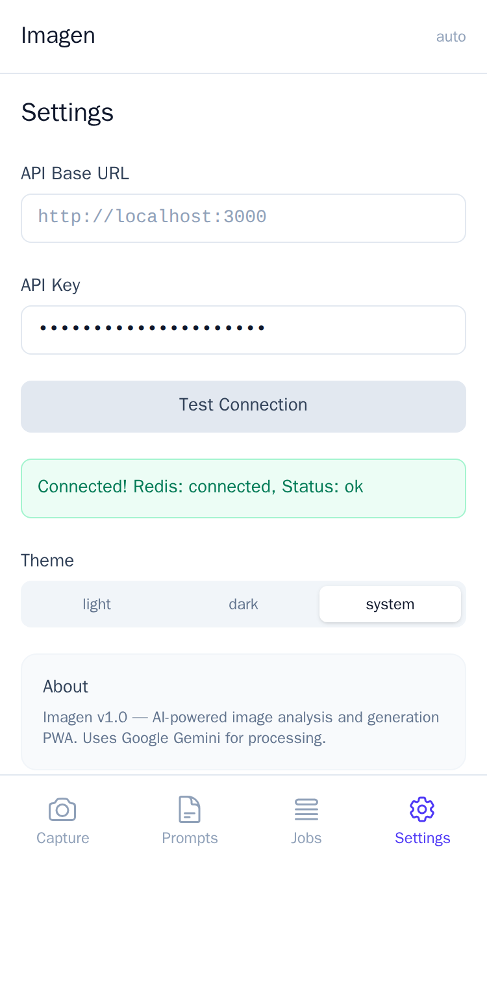
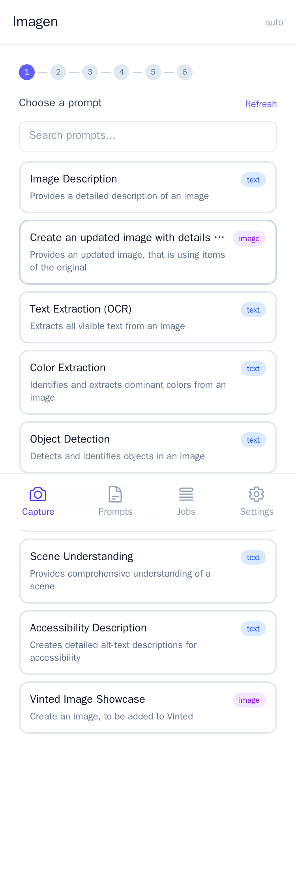
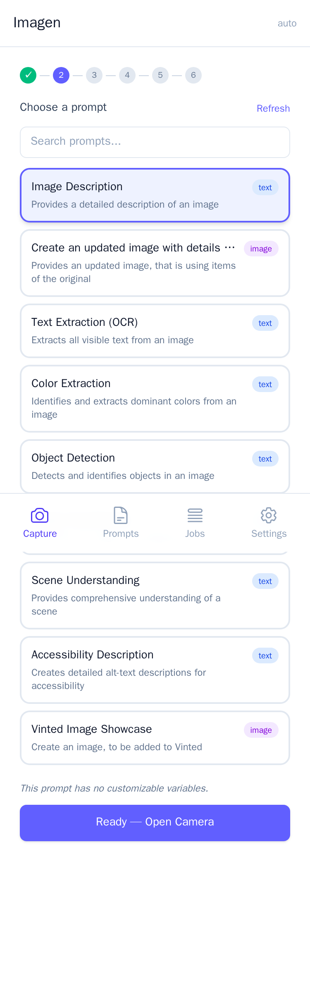
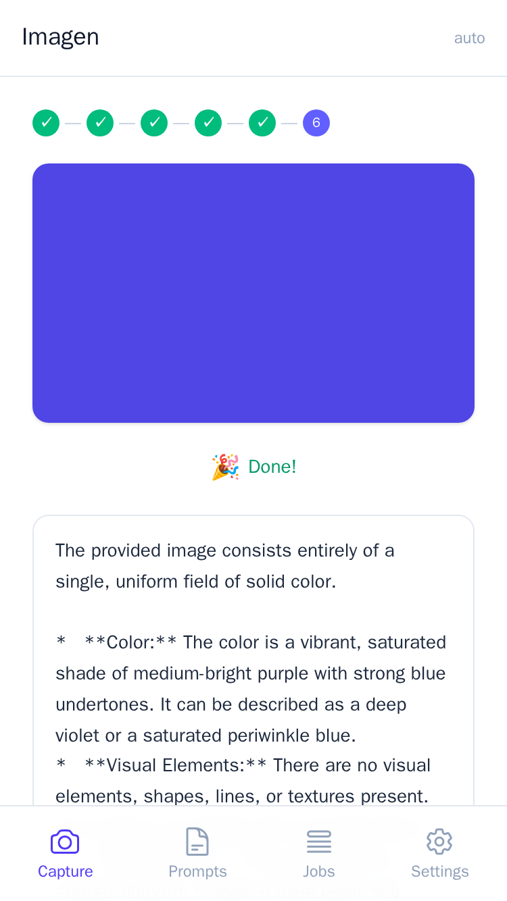
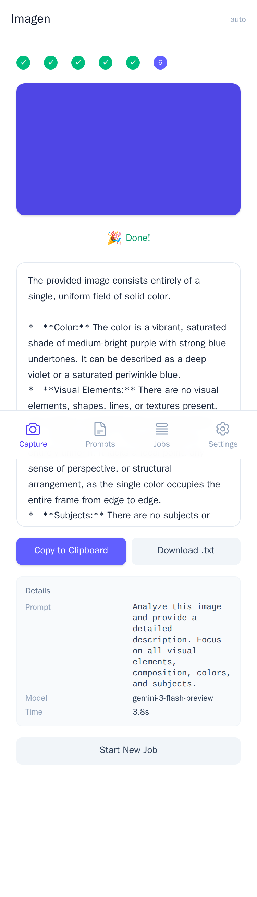
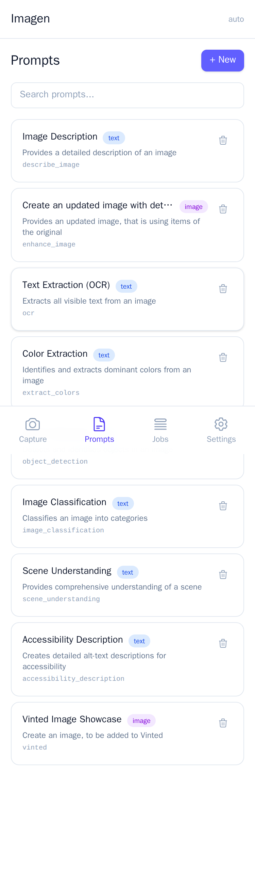
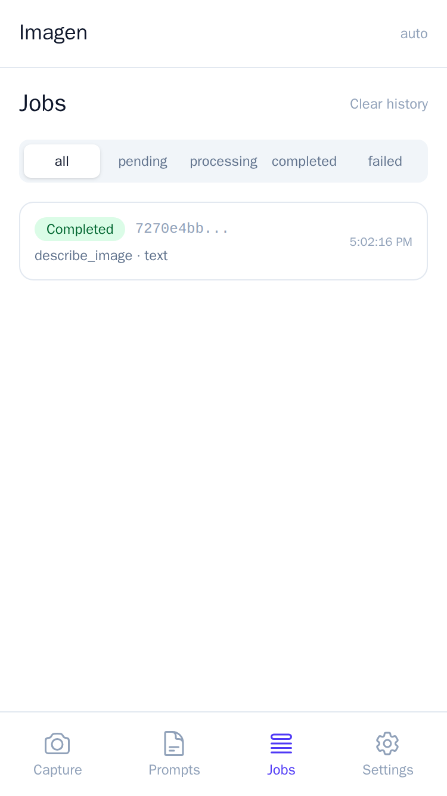
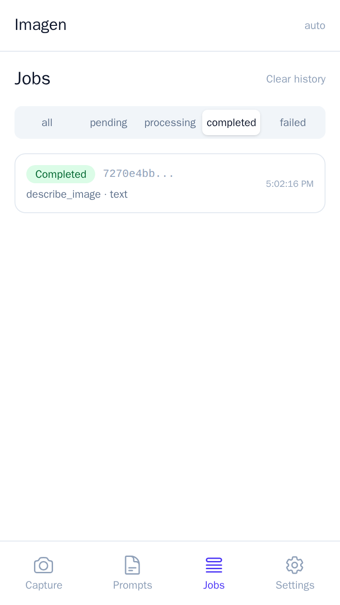

# Imagen

AI image generation pipeline with a React PWA frontend and a Node.js/Redis backend.

## Repository Structure

```
imagen/
├── backend/          Node.js REST API + background job worker
│   ├── src/          Application source (routes, controllers, services, workers)
│   ├── tests/        Integration & unit tests
│   ├── data/         Prompt library (prompts.json, etc.)
│   ├── uploads/      Incoming image uploads (runtime, gitignored)
│   ├── results/      Generated image output (runtime, gitignored)
│   ├── Dockerfile    Multi-stage Node image for api & worker
│   └── package.json
├── frontend/         React + Vite PWA (TypeScript)
│   ├── src/          App source (components, features, stores, hooks)
│   ├── public/       Static assets, PWA manifest, icons
│   ├── nginx.conf    nginx config for the production container
│   ├── Dockerfile    Multi-stage Vite build → nginx image
│   └── package.json
└── docker-compose.yml  Full stack: redis + api + worker + frontend
```

## Architecture

```
Browser
  │
  └─► External nginx (SSL :443)
          │
          └─► frontend container (:8090)
                  ├── /*          → React SPA (served by nginx)
                  └── /health     ┐
                      /jobs/*     ├─► api container (:3000, internal only)
                      /prompts/*  ┘
```

- **redis** — job queue and ephemeral state store (internal network only)
- **api** — Express REST API, enqueues generation jobs to Redis
- **worker** — BullMQ worker, pulls jobs from Redis, calls the AI image API, saves results
- **frontend** — React PWA built with Vite, served by nginx which also reverse-proxies `/jobs/*` and `/prompts/*` to the api, keeping everything same-origin (no CORS needed)

The backend is never exposed directly to the outside; all external traffic enters through the frontend nginx container.

## Quick Start

```bash
# 1. Copy and configure environment
cp backend/.env.example .env
# Fill in at minimum:
#   GEMINI_API_KEY=<your key>
#   API_KEY=<a random secret used to authenticate API requests>

# 2. Build and start all services
docker compose up --build -d

# 3. Access the app
open http://localhost:8090
```

## Environment Variables

Defined in `.env` at the repo root (next to `docker-compose.yml`).
See `backend/.env.example` for the full list with descriptions.

Key variables:

| Variable         | Description                                      |
|-----------------|--------------------------------------------------|
| GEMINI_API_KEY  | Google Gemini API key for image generation        |
| API_KEY         | Shared secret for API authentication             |
| REDIS_URL       | Overridden automatically in Docker (redis://redis:6379) |
| ALLOWED_ORIGINS | CORS origins; leave empty behind a reverse proxy |

## Development

### Backend (Node.js)

```bash
cd backend
npm install
cp .env.example .env   # fill in vars
npm run dev            # starts api with nodemon
node src/workers/jobWorker.js   # start worker separately
```

### Frontend (React + Vite)

```bash
cd frontend
npm install
npm run dev            # Vite dev server on :5173
```

Set `VITE_API_URL=http://localhost:3000` in `frontend/.env.local` to point at the local backend.

## Tests

```bash
# Backend
cd backend && npm test

# Frontend
cd frontend && npm test
```

## Ports (Docker)

| Service  | Internal | Exposed  | Notes                        |
|----------|----------|----------|------------------------------|
| redis    | 6379     | —        | Internal only                |
| api      | 3000     | —        | Proxied via frontend nginx   |
| worker   | —        | —        | No HTTP server               |
| frontend | 80       | **8090** | Entry point for all traffic  |

## App Screenshots

The PWA is designed for mobile-first use. Screenshots captured at 375×667 (iPhone SE viewport).

### Workflow

The app guides users through a 6-step workflow:

1. **Choose a prompt** — select an AI-powered image task
2. **Capture image** — use camera or gallery upload
3. **Processing** — the job is queued and processed by Gemini
4. **Review result** — view the AI-generated output

**Settings** — Configure your API key and test the connection:



**Prompt Selection** — Browse available prompts (image description, OCR, object detection, color extraction, and more):



**Prompt Selected** — After choosing "Image Description", the workflow advances to Step 2:



**Image Upload** — Upload an image from gallery or capture with camera, then processing begins:



**Result** — The AI-processed result with description displayed:



### Management Pages

**Prompts** — View, search, and manage the prompt library:



**Jobs** — Monitor job status (all, pending, processing, completed, failed):



**Jobs — Completed** — Filter to completed jobs with their results:



### Available Prompts

| Prompt | Type | Description |
|--------|------|-------------|
| Image Description | text | Provides a detailed description of an image |
| Create Updated Image | image | Creates an updated image using original items |
| Text Extraction (OCR) | text | Extracts all visible text from an image |
| Color Extraction | text | Identifies and extracts dominant colors |
| Object Detection | text | Detects and identifies objects |
| Image Classification | text | Classifies an image into categories |
| Scene Understanding | text | Provides comprehensive scene understanding |
| Accessibility Description | text | Creates alt-text descriptions for accessibility |
| Vinted Image Showcase | image | Creates a Vinted-optimized showcase image |

### Generating Screenshots

Screenshots are captured via Playwright in a Docker container:

```bash
cd doc
docker build -t imagen-screenshots .
docker run --name imagen-screenshots-tmp --add-host host.docker.internal:host-gateway imagen-screenshots
docker cp imagen-screenshots-tmp:/work/*.png .
docker rm -f imagen-screenshots-tmp
```

Requires Docker and the `mcr.microsoft.com/playwright/python` base image.
