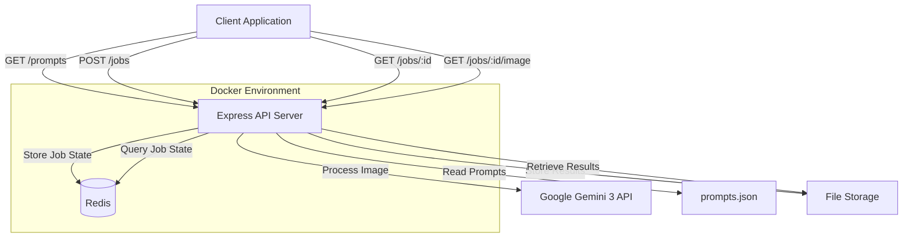
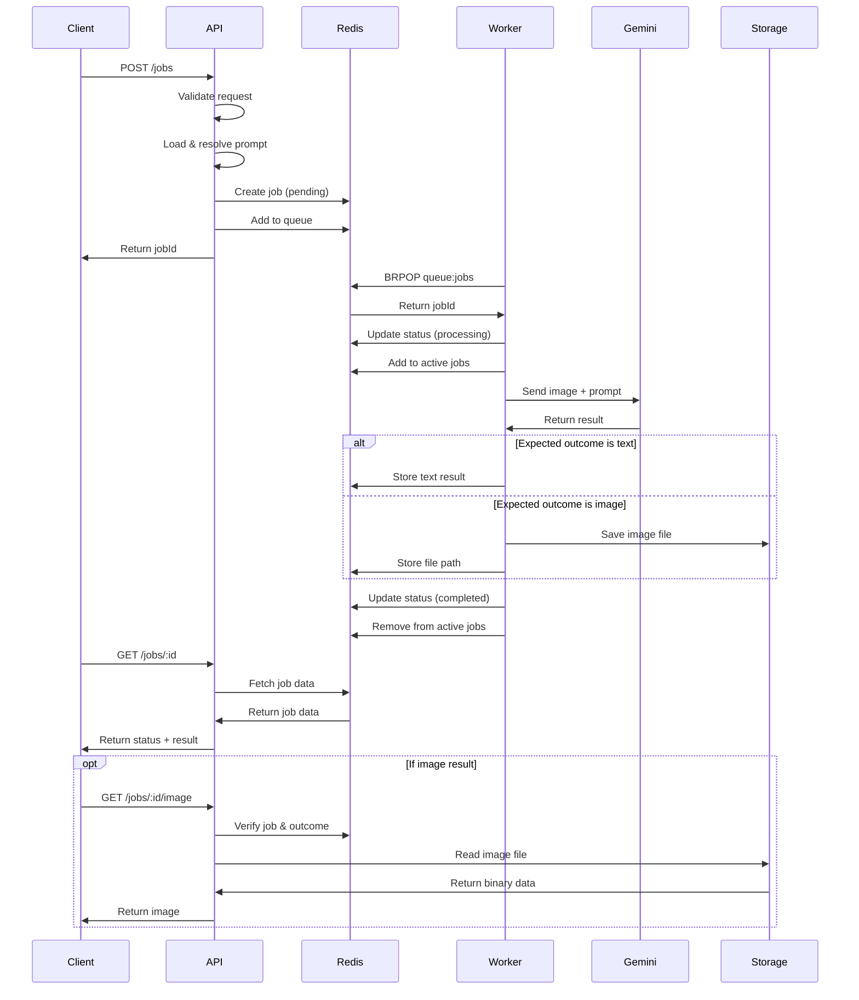

# Image Processing API with Google Gemini 3 - Architecture Design

## Overview

This document outlines the architecture for a Node.js Express API that processes images using Google Gemini 3. The system handles asynchronous job processing with Redis-based state management and supports both text and image outputs.

## System Architecture



## API Specification

### Endpoints

#### 1. List Prompts
**GET /prompts**

Retrieves a list of all available prompt templates.

**Response (200 OK):**
```json
{
  "prompts": [
    {
      "id": "string",
      "name": "string",
      "description": "string",
      "requiredVariables": ["string"],
      "supportedOutcomes": ["text", "image"]
    }
  ]
}
```

**Error Responses:**
- 500 Internal Server Error: Server error

#### 2. Submit Job
**POST /jobs**

Creates a new image processing job.

**Request Body:**
```json
{
  "promptId": "string (required) - ID referencing prompt in prompts.json",
  "variables": {
    "key": "value - Dynamic variables for prompt template substitution"
  },
  "expectedOutcome": "text | image (required) - Expected result type",
  "image": {
    "data": "string (base64) - Base64 encoded image data",
    "mimeType": "string - image/jpeg, image/png, etc.",
    "url": "string - Alternative to data, URL to fetch image"
  }
}
```

**Response (201 Created):**
```json
{
  "jobId": "string - Unique job identifier (UUID)",
  "status": "pending",
  "createdAt": "ISO 8601 timestamp"
}
```

**Error Responses:**
- 400 Bad Request: Invalid input (missing required fields, invalid promptId)
- 413 Payload Too Large: Image exceeds size limit
- 500 Internal Server Error: Server error

#### 2. Get Job Status
**GET /jobs/:id**

Retrieves job status and results.

**Response (200 OK):**
```json
{
  "jobId": "string",
  "status": "pending | processing | completed | failed",
  "promptId": "string",
  "expectedOutcome": "text | image",
  "createdAt": "ISO 8601 timestamp",
  "updatedAt": "ISO 8601 timestamp",
  "completedAt": "ISO 8601 timestamp (if completed)",
  "result": {
    "text": "string (if expectedOutcome is text and status is completed)"
  },
  "error": {
    "message": "string (if status is failed)",
    "code": "string"
  },
  "metadata": {
    "processingTime": "number (milliseconds)",
    "promptUsed": "string - Resolved prompt text",
    "modelVersion": "string - Gemini model version used"
  }
}
```

**Error Responses:**
- 404 Not Found: Job ID does not exist
- 500 Internal Server Error: Server error

#### 3. Get Job Image Result
**GET /jobs/:id/image**

Retrieves the image result for jobs with `expectedOutcome: "image"`.

**Response (200 OK):**
- Content-Type: image/jpeg, image/png, etc.
- Body: Binary image data

**Error Responses:**
- 404 Not Found: Job ID does not exist or no image result available
- 400 Bad Request: Job outcome type is not image
- 409 Conflict: Job not yet completed
- 500 Internal Server Error: Server error

### OpenAPI 3.0 Specification Summary

```yaml
openapi: 3.0.0
info:
  title: Image Processing API
  version: 1.0.0
  description: Asynchronous image processing using Google Gemini 3

paths:
  /jobs:
    post:
      summary: Submit a new image processing job
      requestBody:
        required: true
        content:
          application/json:
            schema:
              $ref: '#/components/schemas/JobSubmission'
      responses:
        '201':
          description: Job created successfully
          content:
            application/json:
              schema:
                $ref: '#/components/schemas/JobCreated'
  
  /jobs/{id}:
    get:
      summary: Get job status and results
      parameters:
        - name: id
          in: path
          required: true
          schema:
            type: string
      responses:
        '200':
          description: Job details
          content:
            application/json:
              schema:
                $ref: '#/components/schemas/JobStatus'
  
  /jobs/{id}/image:
    get:
      summary: Get image result
      parameters:
        - name: id
          in: path
          required: true
          schema:
            type: string
      responses:
        '200':
          description: Image binary data
          content:
            image/*:
              schema:
                type: string
                format: binary
```

## Redis Data Structures

### Job State Storage

**Key Pattern:** `job:{jobId}`

**Data Structure:** Hash

**Fields:**
```
jobId: string (UUID)
status: string (pending|processing|completed|failed)
promptId: string
expectedOutcome: string (text|image)
createdAt: string (ISO 8601)
updatedAt: string (ISO 8601)
completedAt: string (ISO 8601, optional)
resultText: string (if outcome is text)
resultImagePath: string (if outcome is image, path to stored file)
errorMessage: string (if failed)
errorCode: string (if failed)
processingTime: number (milliseconds)
promptUsed: string (resolved prompt)
modelVersion: string
variables: string (JSON stringified)
imageMimeType: string
```

**TTL:** 24 hours (configurable)

### Job Queue

**Key Pattern:** `queue:jobs`

**Data Structure:** List (FIFO queue)

**Purpose:** Stores pending job IDs for worker processing

**Operations:**
- LPUSH: Add new jobs
- BRPOP: Workers retrieve jobs

### Job Status Index

**Key Pattern:** `jobs:status:{status}`

**Data Structure:** Set

**Purpose:** Quick lookup of jobs by status

**Members:** Job IDs

### Active Jobs Tracking

**Key Pattern:** `jobs:active`

**Data Structure:** Set

**Purpose:** Track currently processing jobs

**Members:** Job IDs

### Example Redis Commands

```bash
# Create a job
HSET job:abc-123 jobId abc-123 status pending promptId analyze-image expectedOutcome text createdAt 2026-01-17T17:00:00Z

# Add to queue
LPUSH queue:jobs abc-123

# Add to status index
SADD jobs:status:pending abc-123

# Update job status
HSET job:abc-123 status processing updatedAt 2026-01-17T17:00:05Z
SMOVE jobs:status:pending jobs:status:processing abc-123

# Complete job
HSET job:abc-123 status completed completedAt 2026-01-17T17:00:30Z resultText "Analysis result"
SMOVE jobs:status:processing jobs:status:completed abc-123
SREM jobs:active abc-123

# Set expiration
EXPIRE job:abc-123 86400
```

## Prompts Configuration

### prompts.json Schema

```json
{
  "$schema": "http://json-schema.org/draft-07/schema#",
  "type": "object",
  "properties": {
    "prompts": {
      "type": "array",
      "items": {
        "type": "object",
        "required": ["id", "name", "template", "supportedOutcomes"],
        "properties": {
          "id": {
            "type": "string",
            "description": "Unique identifier for the prompt"
          },
          "name": {
            "type": "string",
            "description": "Human-readable name"
          },
          "description": {
            "type": "string",
            "description": "What this prompt does"
          },
          "template": {
            "type": "string",
            "description": "Prompt template with {{variable}} placeholders"
          },
          "supportedOutcomes": {
            "type": "array",
            "items": {
              "type": "string",
              "enum": ["text", "image"]
            },
            "description": "Supported output types"
          },
          "requiredVariables": {
            "type": "array",
            "items": {
              "type": "string"
            },
            "description": "Required variable names for template"
          },
          "defaultVariables": {
            "type": "object",
            "description": "Default values for optional variables"
          },
          "examples": {
            "type": "array",
            "items": {
              "type": "object",
              "properties": {
                "variables": {
                  "type": "object"
                },
                "description": {
                  "type": "string"
                }
              }
            }
          }
        }
      }
    }
  }
}
```

### Example prompts.json

```json
{
  "prompts": [
    {
      "id": "analyze-image",
      "name": "Image Analysis",
      "description": "Analyzes an image and provides detailed description",
      "template": "Analyze this image and provide a {{detail_level}} description focusing on {{focus_area}}.",
      "supportedOutcomes": ["text"],
      "requiredVariables": [],
      "defaultVariables": {
        "detail_level": "detailed",
        "focus_area": "all aspects"
      },
      "examples": [
        {
          "variables": {
            "detail_level": "brief",
            "focus_area": "colors and composition"
          },
          "description": "Quick color and composition analysis"
        }
      ]
    },
    {
      "id": "extract-text",
      "name": "OCR Text Extraction",
      "description": "Extracts text from images",
      "template": "Extract all text from this image. Format: {{format}}",
      "supportedOutcomes": ["text"],
      "requiredVariables": [],
      "defaultVariables": {
        "format": "plain text"
      }
    },
    {
      "id": "generate-variation",
      "name": "Image Variation Generator",
      "description": "Generates a variation of the input image",
      "template": "Generate a variation of this image with the following modifications: {{modifications}}. Style: {{style}}",
      "supportedOutcomes": ["image"],
      "requiredVariables": ["modifications"],
      "defaultVariables": {
        "style": "maintain original style"
      }
    },
    {
      "id": "object-detection",
      "name": "Object Detection",
      "description": "Detects and lists objects in the image",
      "template": "Identify and list all {{object_type}} in this image. Include {{include_details}}.",
      "supportedOutcomes": ["text"],
      "requiredVariables": [],
      "defaultVariables": {
        "object_type": "objects",
        "include_details": "position and confidence scores"
      }
    }
  ]
}
```

## Project Structure

```
imagen/
├── src/
│   ├── api/
│   │   ├── routes/
│   │   │   ├── jobs.routes.js          # Job endpoints
│   │   │   └── health.routes.js        # Health check endpoint
│   │   ├── controllers/
│   │   │   └── jobs.controller.js      # Request handlers
│   │   ├── middleware/
│   │   │   ├── errorHandler.js         # Global error handling
│   │   │   ├── validation.js           # Request validation
│   │   │   └── rateLimiter.js          # Rate limiting
│   │   └── validators/
│   │       └── job.validator.js        # Job schema validation
│   ├── services/
│   │   ├── gemini.service.js           # Google Gemini 3 integration
│   │   ├── job.service.js              # Job business logic
│   │   ├── prompt.service.js           # Prompt loading and processing
│   │   └── storage.service.js          # File storage operations
│   ├── workers/
│   │   └── jobProcessor.worker.js      # Background job processor
│   ├── repositories/
│   │   └── job.repository.js           # Redis data access layer
│   ├── config/
│   │   ├── redis.config.js             # Redis configuration
│   │   ├── gemini.config.js            # Gemini API configuration
│   │   └── app.config.js               # Application configuration
│   ├── utils/
│   │   ├── logger.js                   # Winston logger setup
│   │   ├── errors.js                   # Custom error classes
│   │   └── imageProcessor.js           # Image utilities
│   └── app.js                          # Express app setup
├── data/
│   ├── prompts.json                    # Prompt templates
│   └── results/                        # Stored image results
│       └── .gitkeep
├── tests/
│   ├── unit/
│   │   ├── services/
│   │   └── repositories/
│   ├── integration/
│   │   └── api/
│   └── fixtures/
│       └── test-images/
├── scripts/
│   └── setup.sh                        # Environment setup script
├── .env.example                        # Environment variables template
├── .gitignore
├── Dockerfile                          # Application container
├── docker-compose.yml                  # Multi-container setup
├── package.json
├── package-lock.json
└── README.md
```

## Dependencies

### Production Dependencies

```json
{
  "dependencies": {
    "@google/generative-ai": "^0.21.0",
    "express": "^4.18.2",
    "redis": "^4.6.13",
    "dotenv": "^16.4.5",
    "joi": "^17.12.2",
    "uuid": "^9.0.1",
    "winston": "^3.11.0",
    "express-rate-limit": "^7.1.5",
    "helmet": "^7.1.0",
    "cors": "^2.8.5",
    "multer": "^1.4.5-lts.1",
    "sharp": "^0.33.2",
    "axios": "^1.6.7"
  }
}
```

### Development Dependencies

```json
{
  "devDependencies": {
    "nodemon": "^3.0.3",
    "jest": "^29.7.0",
    "supertest": "^6.3.4",
    "eslint": "^8.56.0",
    "eslint-config-airbnb-base": "^15.0.0",
    "eslint-plugin-import": "^2.29.1",
    "prettier": "^3.2.4"
  }
}
```

### Dependency Justification

- **@google/generative-ai**: Official Google Gemini API client
- **express**: Web framework for REST API
- **redis**: Redis client for job state management
- **dotenv**: Environment variable management
- **joi**: Request validation
- **uuid**: Unique job ID generation
- **winston**: Structured logging
- **express-rate-limit**: API rate limiting
- **helmet**: Security headers
- **cors**: Cross-origin resource sharing
- **multer**: Multipart form data handling (image uploads)
- **sharp**: Image processing and optimization
- **axios**: HTTP client for fetching images from URLs
- **nodemon**: Development auto-reload
- **jest**: Testing framework
- **supertest**: HTTP assertion library
- **eslint/prettier**: Code quality and formatting

## Infrastructure Configuration

### Dockerfile

```dockerfile
FROM node:20-alpine

WORKDIR /app

# Install dependencies
COPY package*.json ./
RUN npm ci --only=production

# Copy application code
COPY . .

# Create directories
RUN mkdir -p data/results

# Non-root user
RUN addgroup -g 1001 -S nodejs && \
    adduser -S nodejs -u 1001 && \
    chown -R nodejs:nodejs /app

USER nodejs

EXPOSE 3000

CMD ["node", "src/app.js"]
```

### docker-compose.yml

```yaml
version: '3.8'

services:
  api:
    build: .
    ports:
      - "3000:3000"
    environment:
      - NODE_ENV=production
      - REDIS_HOST=redis
      - REDIS_PORT=6379
      - GEMINI_API_KEY=${GEMINI_API_KEY}
      - PORT=3000
      - LOG_LEVEL=info
      - MAX_IMAGE_SIZE=10485760
      - JOB_TTL=86400
    volumes:
      - ./data:/app/data
      - ./data/results:/app/data/results
    depends_on:
      redis:
        condition: service_healthy
    restart: unless-stopped
    healthcheck:
      test: ["CMD", "wget", "--quiet", "--tries=1", "--spider", "http://localhost:3000/health"]
      interval: 30s
      timeout: 10s
      retries: 3
      start_period: 40s

  redis:
    image: redis:7-alpine
    ports:
      - "6379:6379"
    volumes:
      - redis-data:/data
    command: redis-server --appendonly yes
    restart: unless-stopped
    healthcheck:
      test: ["CMD", "redis-cli", "ping"]
      interval: 10s
      timeout: 5s
      retries: 5

  worker:
    build: .
    command: node src/workers/jobProcessor.worker.js
    environment:
      - NODE_ENV=production
      - REDIS_HOST=redis
      - REDIS_PORT=6379
      - GEMINI_API_KEY=${GEMINI_API_KEY}
      - LOG_LEVEL=info
    volumes:
      - ./data:/app/data
      - ./data/results:/app/data/results
    depends_on:
      redis:
        condition: service_healthy
    restart: unless-stopped
    deploy:
      replicas: 2

volumes:
  redis-data:
```

### Setup Script (scripts/setup.sh)

```bash
#!/bin/bash

set -e

echo "=== Image Processing API Setup ==="

# Check prerequisites
command -v docker >/dev/null 2>&1 || { echo "Docker is required but not installed. Aborting." >&2; exit 1; }
command -v docker-compose >/dev/null 2>&1 || { echo "Docker Compose is required but not installed. Aborting." >&2; exit 1; }

# Create .env file if it doesn't exist
if [ ! -f .env ]; then
    echo "Creating .env file from template..."
    cp .env.example .env
    echo "Please edit .env and add your GEMINI_API_KEY"
    exit 1
fi

# Check for GEMINI_API_KEY
source .env
if [ -z "$GEMINI_API_KEY" ]; then
    echo "Error: GEMINI_API_KEY not set in .env file"
    exit 1
fi

# Create necessary directories
echo "Creating directories..."
mkdir -p data/results
mkdir -p tests/fixtures/test-images

# Create prompts.json if it doesn't exist
if [ ! -f data/prompts.json ]; then
    echo "Creating default prompts.json..."
    cat > data/prompts.json << 'EOF'
{
  "prompts": [
    {
      "id": "analyze-image",
      "name": "Image Analysis",
      "description": "Analyzes an image and provides detailed description",
      "template": "Analyze this image and provide a {{detail_level}} description focusing on {{focus_area}}.",
      "supportedOutcomes": ["text"],
      "requiredVariables": [],
      "defaultVariables": {
        "detail_level": "detailed",
        "focus_area": "all aspects"
      }
    }
  ]
}
EOF
fi

# Build Docker images
echo "Building Docker images..."
docker-compose build

# Start services
echo "Starting services..."
docker-compose up -d

# Wait for services to be healthy
echo "Waiting for services to be ready..."
sleep 10

# Check health
echo "Checking API health..."
curl -f http://localhost:3000/health || { echo "API health check failed"; exit 1; }

echo ""
echo "=== Setup Complete ==="
echo "API is running at http://localhost:3000"
echo "Redis is running at localhost:6379"
echo ""
echo "To view logs: docker-compose logs -f"
echo "To stop: docker-compose down"
```

## Processing Flow



## Error Handling Strategy

### Error Categories

1. **Validation Errors (400)**
   - Invalid promptId
   - Missing required fields
   - Invalid image format
   - Unsupported outcome type for prompt

2. **Resource Errors (404)**
   - Job not found
   - Image result not available

3. **State Errors (409)**
   - Job not completed yet
   - Outcome type mismatch

4. **Rate Limiting (429)**
   - Too many requests

5. **Server Errors (500)**
   - Redis connection failure
   - Gemini API errors
   - File system errors

### Error Response Format

```json
{
  "error": {
    "code": "ERROR_CODE",
    "message": "Human-readable error message",
    "details": {
      "field": "Additional context"
    },
    "timestamp": "ISO 8601 timestamp",
    "requestId": "UUID for tracking"
  }
}
```

## Security Considerations

1. **API Key Protection**
   - Store Gemini API key in environment variables
   - Never expose in logs or responses

2. **Input Validation**
   - Validate all inputs with Joi schemas
   - Sanitize file uploads
   - Limit image size (default: 10MB)

3. **Rate Limiting**
   - Per-IP rate limiting
   - Configurable limits per endpoint

4. **CORS Configuration**
   - Whitelist allowed origins
   - Restrict methods and headers

5. **Security Headers**
   - Use Helmet.js for security headers
   - CSP, HSTS, X-Frame-Options, etc.

6. **Data Expiration**
   - Automatic job cleanup after TTL
   - Periodic cleanup of old result files

## Scalability Considerations

1. **Horizontal Scaling**
   - Stateless API servers
   - Multiple worker instances
   - Load balancer ready

2. **Redis Optimization**
   - Connection pooling
   - Pipeline operations where possible
   - Appropriate TTLs to manage memory

3. **Worker Scaling**
   - Configurable worker count via docker-compose
   - Independent scaling from API servers

4. **Storage Strategy**
   - Local file storage for MVP
   - Easy migration to S3/Cloud Storage
   - Abstracted storage service

5. **Monitoring**
   - Structured logging with Winston
   - Health check endpoints
   - Job metrics tracking

## Configuration Management

### Environment Variables

```bash
# Application
NODE_ENV=production
PORT=3000
LOG_LEVEL=info

# Redis
REDIS_HOST=redis
REDIS_PORT=6379
REDIS_PASSWORD=
REDIS_DB=0

# Google Gemini
GEMINI_API_KEY=your-api-key-here
GEMINI_MODEL=gemini-3-pro-vision

# Job Configuration
JOB_TTL=86400
MAX_IMAGE_SIZE=10485760
MAX_CONCURRENT_JOBS=10

# Storage
RESULTS_PATH=./data/results

# Rate Limiting
RATE_LIMIT_WINDOW_MS=900000
RATE_LIMIT_MAX_REQUESTS=100
```

## Testing Strategy

1. **Unit Tests**
   - Service layer logic
   - Prompt template resolution
   - Redis repository operations
   - Utility functions

2. **Integration Tests**
   - API endpoint testing
   - Redis integration
   - Worker processing flow

3. **E2E Tests**
   - Complete job lifecycle
   - Error scenarios
   - Image upload and retrieval

4. **Load Tests**
   - Concurrent job submission
   - Worker throughput
   - Redis performance

## Deployment Checklist

- [ ] Set GEMINI_API_KEY in .env
- [ ] Configure CORS allowed origins
- [ ] Set appropriate rate limits
- [ ] Configure log levels
- [ ] Set job TTL based on requirements
- [ ] Configure max image size
- [ ] Set up monitoring/alerting
- [ ] Configure backup strategy for Redis
- [ ] Set up SSL/TLS certificates
- [ ] Configure reverse proxy (nginx/traefik)
- [ ] Set up log aggregation
- [ ] Configure health check monitoring

## Future Enhancements

1. **Batch Processing**
   - Submit multiple images in one request
   - Bulk status queries

2. **Webhooks**
   - Notify clients when jobs complete
   - Configurable callback URLs

3. **Advanced Storage**
   - S3/GCS integration
   - CDN for image delivery

4. **Authentication**
   - API key authentication
   - JWT tokens
   - User management

5. **Job Prioritization**
   - Priority queue support
   - Premium processing tiers

6. **Caching**
   - Result caching for identical requests
   - Prompt caching

7. **Analytics**
   - Usage metrics
   - Performance monitoring
   - Cost tracking

8. **Advanced Features**
   - Image preprocessing options
   - Multiple model support
   - Custom model fine-tuning
